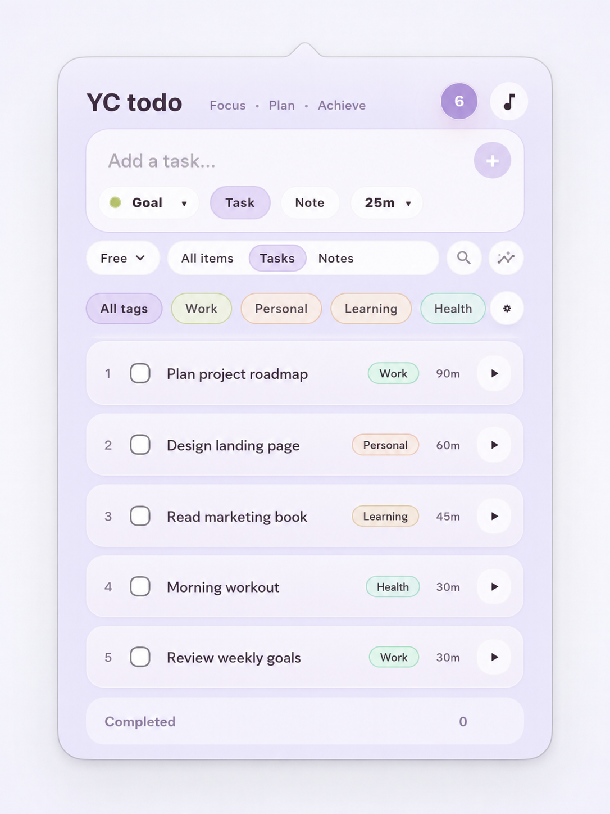
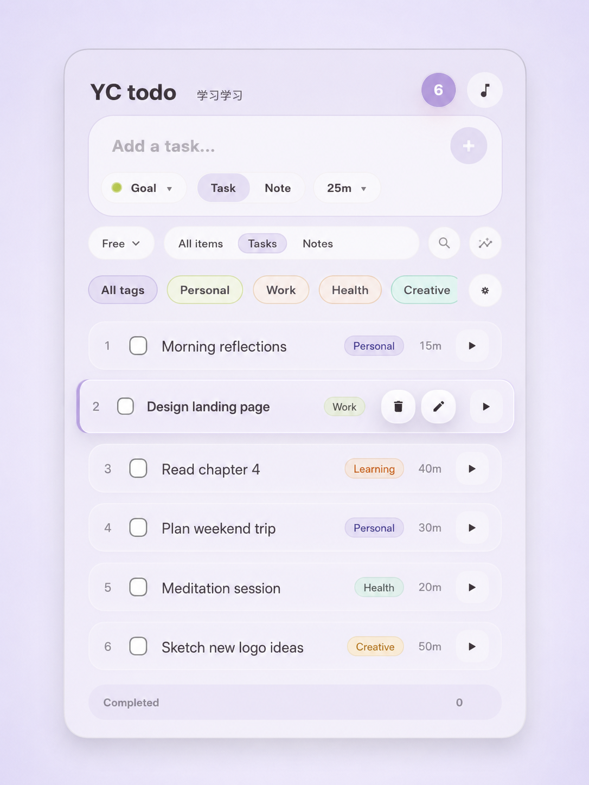
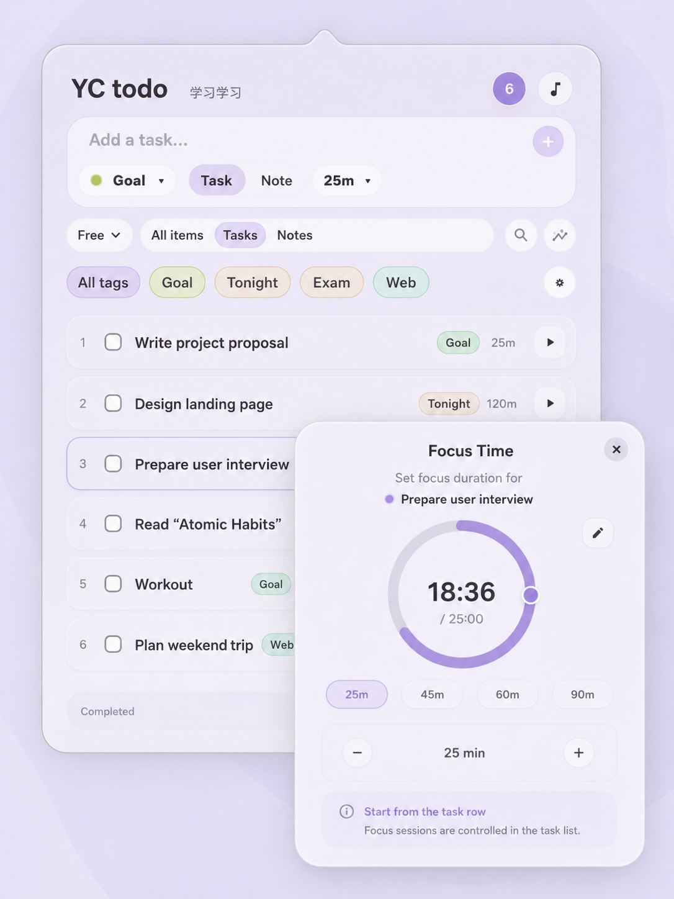
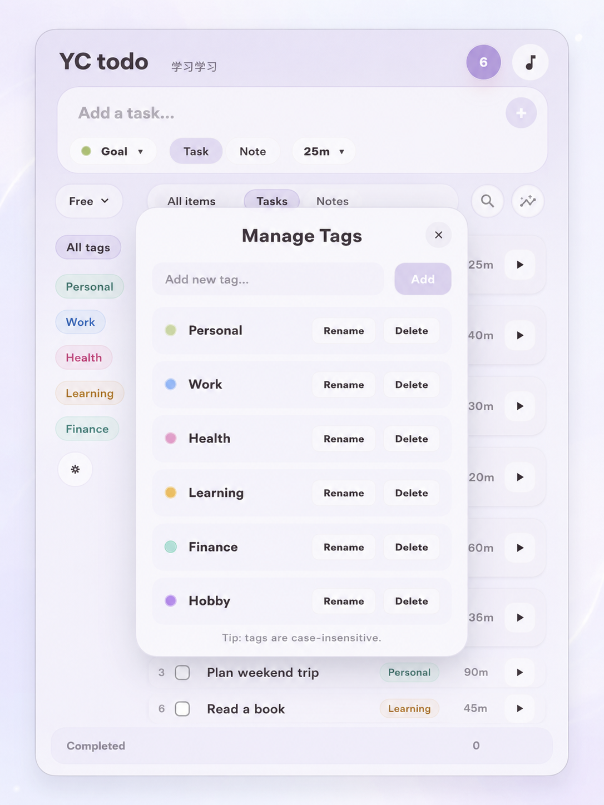
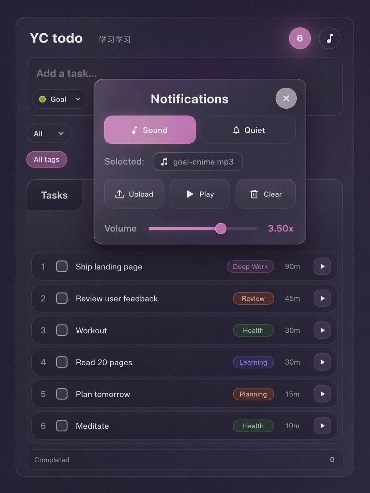

<p align="center">
  
</p>

<h1 align="center">YC Todo</h1>

<p align="center">
  <strong>A calm, local task list and focus timer that lives in your macOS menu bar.</strong>
</p>

<p align="center">
  <a href="https://github.com/ycl-2004/YC_Todo/releases/latest"></a>
  <a href="https://github.com/ycl-2004/YC_Todo/releases"></a>
  
  
  
</p>

<p align="center">
  <a href="https://github.com/ycl-2004/YC_Todo/releases/latest/download/YC-Todo-macOS-universal.zip"><strong>⬇ Download for macOS</strong></a>
  ·
  <a href="https://github.com/ycl-2004/YC_Todo/releases">Releases</a>
  ·
  <a href="#features">Features</a>
  ·
  <a href="#privacy">Privacy</a>
  ·
  <a href="#build-from-source">Build from source</a>
</p>

YC Todo keeps task capture, tags, focus timing, notes, and completion controls
one click away without opening a full desktop window. It has no account, no
analytics, and no runtime network service—tasks and settings stay on your Mac.

The downloadable ZIP is a single Universal 2 build for both Apple Silicon and
Intel Macs.

> **Current distribution status:** the public build is ad-hoc signed and is not
> Apple-notarized. macOS therefore requires Control-click → **Open** on first
> launch. Developer ID signing and notarization remain a separate release step.

## Quick start

1. **[Download `YC-Todo-macOS-universal.zip`](https://github.com/ycl-2004/YC_Todo/releases/latest/download/YC-Todo-macOS-universal.zip)** and unzip it.
2. Move `YC Todo.app` to `/Applications`.
3. Control-click the app, choose **Open**, and confirm the first launch.
4. Click the YC Todo menu-bar icon and add your first task.

If Control-click → **Open** is unavailable, clear the quarantine flag:

```bash
xattr -dr com.apple.quarantine "/Applications/YC Todo.app"
open "/Applications/YC Todo.app"
```

### System requirements

- macOS 12.0 or later
- Apple Silicon (`arm64`) or Intel (`x86_64`) Mac
- No account or network connection required after download

## Why YC Todo

- **The list stays calm.** Start is always visible; Edit and Delete reveal only
  when you hover, focus, or ask for more actions.
- **Long titles remain readable.** A row-anchored preview appears only when a
  title is actually truncated.
- **Focus and tasks share one place.** Each task can carry a duration and become
  the active menu-bar timer without opening another app.
- **Destructive actions are recoverable.** Deleted tasks and a cleared Completed
  list provide a five-second Undo path.
- **Everything stays local.** There are no accounts, analytics, ads, telemetry,
  or remote task services.

## Features

**Tasks and notes**

- Create, edit, reorder, tag, complete, restore, and delete tasks.
- Add lightweight notes that expand in place without pretending to be timers.
- Filter by task/note type, tag, or text search.
- Preview truncated titles without horizontal scrolling.
- Import and export YC Todo data as JSON through macOS file pickers.

**Focus timer**

- Assign a duration to each task and run one active timer at a time.
- Pause, resume, or finish the active task from the popover.
- Choose **Free** mode to start any task or **Strict** mode to work in order.
- Use quiet notifications, the default sound, or a user-selected alarm file.

**Menu-bar workflow**

- Native 386×546 macOS popover with no normal Dock window.
- Configurable global shortcuts for opening YC Todo and common focus actions.
- System, light, and dark appearance with configurable accent colors.
- Keyboard row navigation, completion, editing, starting, and note expansion.

## Screenshots

These six views show the core workflow in the v0.2 interface. The capture rules
and the purpose of each image are documented in
[`docs/screenshots/README.md`](docs/screenshots/README.md).

<table>
  <tr>
    <td align="center"><strong>Task list</strong><br></td>
    <td align="center"><strong>Progressive actions</strong><br></td>
    <td align="center"><strong>Title preview</strong><br></td>
  </tr>
  <tr>
    <td align="center"><strong>Focus timer</strong><br></td>
    <td align="center"><strong>Tag settings</strong><br></td>
    <td align="center"><strong>Dark mode</strong><br></td>
  </tr>
</table>

## Privacy

- Tasks, tags, focus state, appearance, notification settings, and shortcuts are
  stored locally.
- YC Todo has no accounts, analytics, advertising, telemetry, or runtime network
  requests.
- A selected custom alarm is copied into the app's local container.
- Import, export, and alarm files are accessed only after an explicit macOS file
  picker action.

See [PRIVACY.md](PRIVACY.md) for the precise storage and file-access behavior.

## Current release

YC Todo `0.2.0` is the first Universal macOS release. See the
[`v0.2.0` release notes](docs/releases/v0.2.0.md) and the complete
[changelog](CHANGELOG.md).

The current source version is `0.2.1`, which fixes menu-bar left clicks on
macOS 27 and shows the popover when reopening a running app from Finder.
YC Todo runs in the menu bar without a Dock window. Building from source does
not replace an existing `/Applications`
copy: quit that copy and install the newly built app. The **About** menu version
should match the app you intend to run.
Quit other YC Todo copies before launching a release build to avoid duplicate
menu-bar icons and shortcut registrations.
When the system hides the menu-bar icon, the task popover opens near the upper
right of the active screen instead.
If the icon disappears only while a menu-bar manager such as Thaw is running,
check that manager's current layout. Reopening YC Todo can restore the task
window, but does not override another app's icon-hiding rules.

| Artifact | Purpose |
| --- | --- |
| `YC-Todo-macOS-universal.zip` | Ready-to-run Universal app for Apple Silicon and Intel |
| `YC-Todo-macOS-universal.zip.sha256` | SHA-256 checksum for download verification |

## FAQ

<details>
<summary>macOS says YC Todo cannot be opened because the developer cannot be verified</summary>

The current release is ad-hoc signed and not Apple-notarized. Control-click
`YC Todo.app`, choose **Open**, and confirm once. You can also run the `xattr`
command shown in [Quick start](#quick-start).

</details>

<details>
<summary>Does YC Todo send my tasks anywhere?</summary>

No. YC Todo has no account, sync server, analytics, or telemetry. Installed app
data stays in the local WebView/application container. Only development tools
may access the network while installing npm or Cargo dependencies.

</details>

<details>
<summary>How do I move my data to another Mac?</summary>

Use **Export Data…** from the menu-bar menu, then choose **Import Data…** on the
other Mac. YC Todo uses a human-readable JSON backup selected through the macOS
file picker.

</details>

<details>
<summary>How do I uninstall YC Todo?</summary>

Quit YC Todo from its menu-bar menu, then move `/Applications/YC Todo.app` to the
Trash. Removing the app's macOS container also removes local tasks and settings,
so export a backup first if you may want them later.

</details>

## Build from source

<details>
<summary>Requirements, development commands, and Universal release packaging</summary>

Requirements:

- macOS 12.0 or later
- Node.js 22 or later and npm
- Rust stable with both macOS targets installed
- The macOS prerequisites from the
  [Tauri documentation](https://v2.tauri.app/start/prerequisites/)

```bash
rustup target add aarch64-apple-darwin x86_64-apple-darwin
npm ci
```

Run the complete app in development:

```bash
npm run tauri dev
```

Run repository, frontend, and Rust checks:

```bash
npm run verify
```

Build the same Universal ZIP and checksum used by GitHub Releases:

```bash
npm run release:macos
```

The command builds with Tauri's `universal-apple-darwin` target, verifies both
`arm64` and `x86_64` with `lipo`, ad-hoc signs the app, checks the signature, and
creates:

```text
release/YC-Todo-macOS-universal.zip
release/YC-Todo-macOS-universal.zip.sha256
```

To use an installed Developer ID identity instead of the default ad-hoc
signature:

```bash
CODESIGN_IDENTITY="Developer ID Application: Your Name (TEAMID)" \
npm run release:macos
```

The script enables hardened runtime and timestamping for a non-ad-hoc identity.
Notarization credentials and sandbox entitlements are deliberately not inferred;
follow [the release checklist](docs/release-checklist.md) before public Developer
ID or App Store distribution.

</details>

## Project layout

- `src/` and `src/styles/` — React interface, interactions, and visual system.
- `src-tauri/src/` — native menu-bar lifecycle, shortcuts, dialogs, audio, and
  Tauri commands.
- `src-tauri/vendor/tauri-plugin-nspopover/` — customized macOS popover plugin;
  read its `UPSTREAM.md` before changing it.
- `scripts/` — version synchronization, repository checks, and Universal release
  packaging.
- `docs/screenshots/` — product captures and the public screenshot shot list.
- `docs/decisions/` — architecture and release decision records.

## Versioning and releases

`src-tauri/tauri.conf.json` is the version source of truth. The bump commands
keep Tauri, npm, Cargo, and both lockfiles synchronized:

```bash
npm run bump:patch
npm run bump:minor
npm run bump:major
```

Build the verified artifacts first, then create an annotated `v<version>` tag
and attach the stable ZIP and checksum filenames to the matching GitHub Release.
Release validation is documented in
[docs/release-checklist.md](docs/release-checklist.md); the architectural choice
is recorded in [ADR-0003](docs/decisions/0003-universal-release-artifacts.md).

## Known limitations

- Public builds are ad-hoc signed and not Apple-notarized.
- There is no automatic updater; install new versions manually.
- YC Todo is macOS-only. “Universal” means Apple Silicon and Intel macOS, not
  Windows or Linux.
- App Store sandboxing is not configured for this GitHub release path.

## License

No open-source license has been selected. Public source availability does not
grant permission to copy, modify, redistribute, rebrand, or sell the project.
