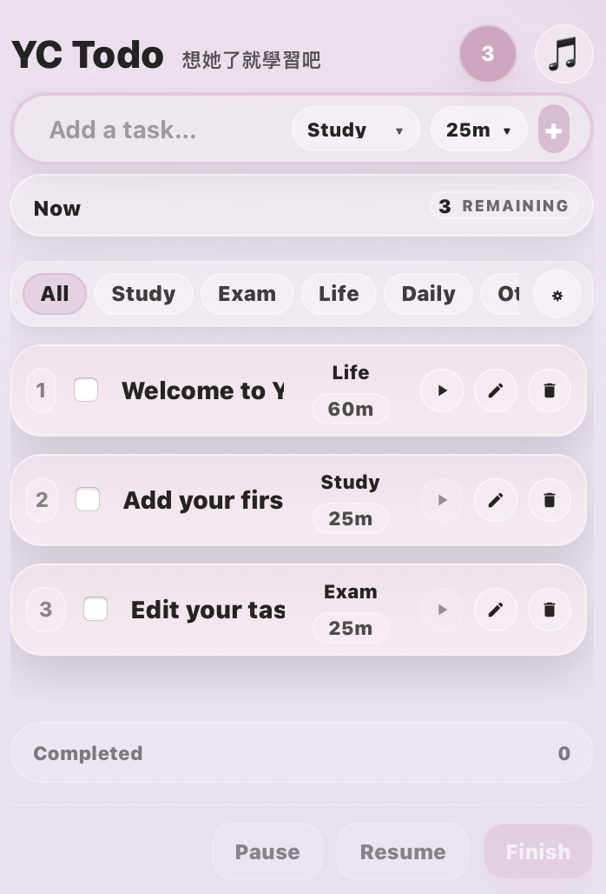

# YC Todo

YC Todo is a lightweight macOS menu bar task and focus app. It keeps task
capture, focus timing, tags, and completion controls one click away without
requiring a full desktop window.



## Features

- Create, edit, reorder, tag, and complete tasks from the menu bar.
- Assign a focus duration and run one active task at a time.
- Use configurable global keyboard shortcuts.
- Choose between quiet and sound-based completion notifications.
- Select a custom alarm sound that is copied into the app's local container.
- Import and export YC Todo data as JSON through system file pickers.
- Follow the macOS light/dark appearance or choose a theme explicitly.

## Privacy

YC Todo has no accounts, analytics, advertising, or runtime network service.
Tasks and settings stay on the Mac. File access occurs only after the user
chooses a custom sound or an import/export location in a system picker.

See [PRIVACY.md](PRIVACY.md) for the precise storage and file-access behavior.

## Requirements

- macOS
- Node.js LTS and npm
- Rust stable toolchain
- The macOS prerequisites listed in the
  [Tauri documentation](https://v2.tauri.app/start/prerequisites/)

## Quick start

```sh
npm ci
npm run tauri dev
```

The official Tauri layout keeps the JavaScript application at the repository
root and the Rust application under `src-tauri/`; this repository follows that
structure.

## Commands

| Command | Purpose |
| --- | --- |
| `npm run dev` | Start the Vite frontend on port 5173 |
| `npm run tauri dev` | Run the complete macOS app in development mode |
| `npm run lint` | Run the current JavaScript lint baseline |
| `npm run build` | Build the frontend into `dist/` |
| `cargo check --manifest-path src-tauri/Cargo.toml --locked` | Check the Rust application and locked dependencies |
| `npm run verify:repo` | Check names, versions, required files, and legacy-path removal |
| `npm run verify` | Run repository, lint, frontend, and Rust checks |
| `npm run tauri build` | Build and bundle the macOS application |

## Project structure

```text
.
├── assets/icons/             # Editable/source icon assets
├── docs/                     # Screenshots, decisions, and release notes
├── public/                   # Frontend static assets
├── scripts/                  # Versioning and repository verification
├── src/                      # React application
└── src-tauri/                # Tauri/Rust app, capabilities, icons, and vendor code
```

The customized `tauri-plugin-nspopover` source is kept under
`src-tauri/vendor/` because YC Todo depends on behavior that differs from the
current upstream plugin. Read its `UPSTREAM.md` before modifying or replacing
it.

## Versioning

`src-tauri/tauri.conf.json` is the source of truth for the app version, matching
Tauri's recommendation. The bump scripts update the Tauri config, npm metadata,
lockfile, and Cargo package together.

```sh
npm run bump:patch
npm run bump:minor
npm run bump:major
```

## Distribution

Local development builds do not require publishing credentials. Signed or App
Store builds require Apple signing setup and the checks in
[docs/release-checklist.md](docs/release-checklist.md).

## License

No open-source license has been selected. Choose one before publishing this
repository as open source.
